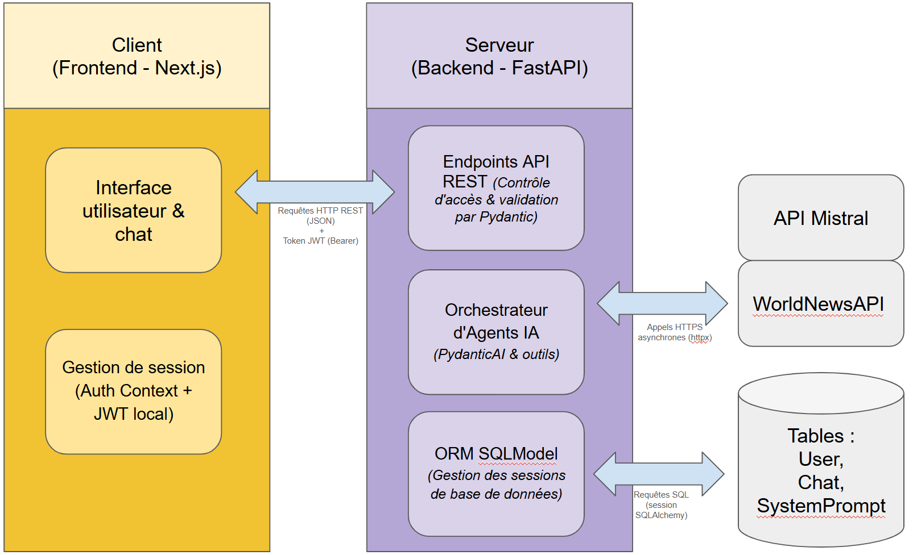
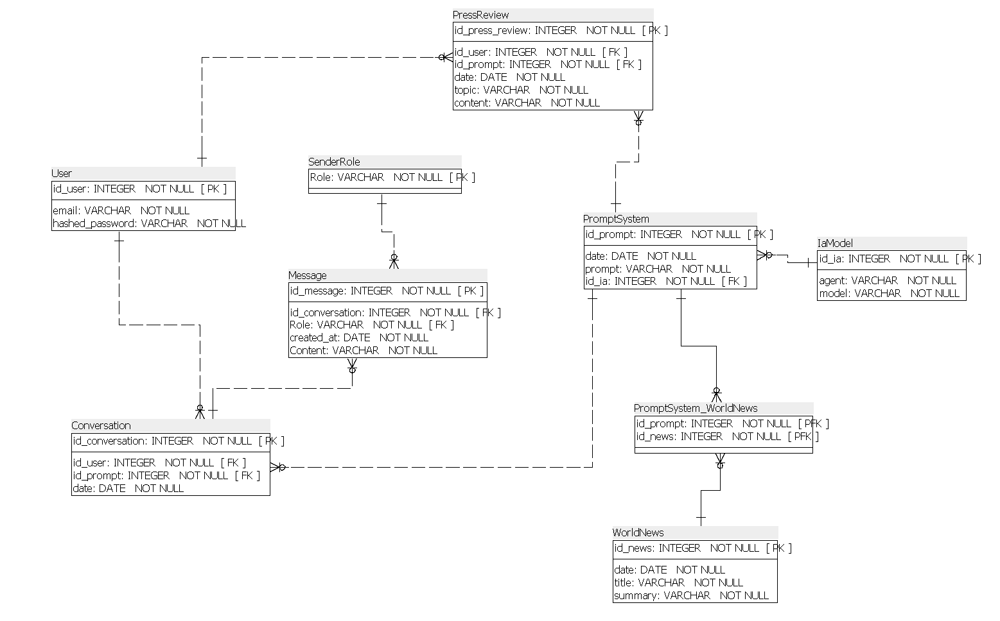
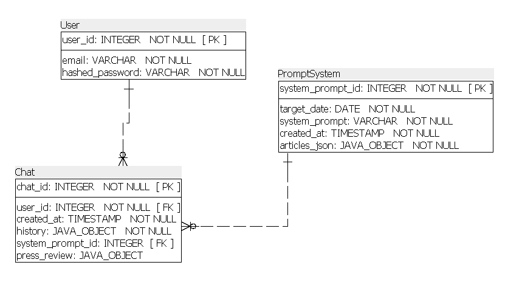
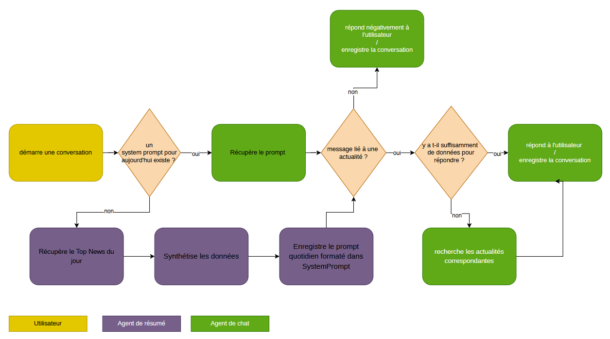
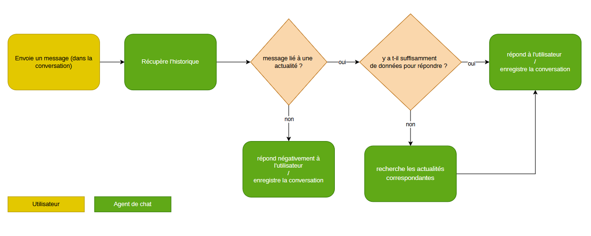
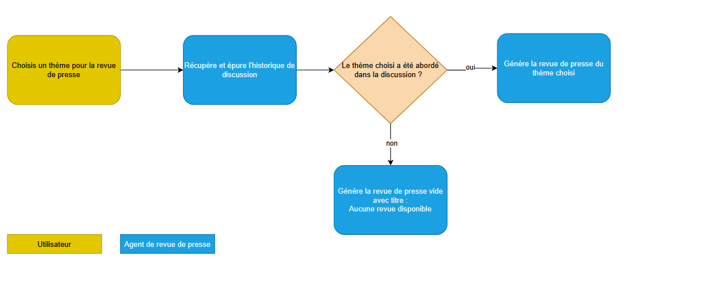

# Architecture Globale et Structure du Code

Ce document présente l'architecture du projet, l'organisation de son code source et le fonctionnement des flux de données clés.

---

## 1. Architecture Système

NewsFoundry utilise une architecture moderne découplée de type **Client-Serveur** :

- **Frontend (Next.js)** : Développée en React (v19) et Next.js (v16). Elle s'occupe de l'interface utilisateur, de la gestion d'état locale (comme la session utilisateur via JWT) et de l'interactivité en temps réel pour le chat et la revue de presse.
- **Backend (FastAPI)** : API REST asynchrone codée en Python. Elle héberge la logique métier (authentification, interaction avec l'agent IA, génération des revues de presse), valide les données grâce à Pydantic et expose des points d'accès (endpoints) documentés.
- **Base de Données (PostgreSQL / SQLite)** :
  - **PostgreSQL** est utilisé en production (hébergé sur Railway) et en développement local pour conserver l'état de l'application (utilisateurs, sessions de chat, historiques des messages, revues de presse).
  - **SQLite (en mémoire)** est utilisé pour exécuter les tests automatisés de manière ultra-rapide et isolée.



---

## 2. Structure de la Codebase

La base de code est divisée en deux répertoires principaux à la racine du projet : `backend` et `frontend`.

### A. Structure du Backend (`backend/`)

Le backend respecte le principe de **Séparation des Responsabilités (Separation of Concerns)**, un patron d'architecture qui consiste à isoler le code selon son rôle (logique d'accès aux données, routes HTTP, services externes, etc.).

```text
backend/
├── src/
│   ├── agent/                 # Configuration des agents IA (PydanticAI)
│   │   ├── agent.py           # Définition des agents (chat_agent, resume_agent, press_review_agent)
│   │   ├── prompts.py         # Chaînes de caractères des invites système (system prompts)
│   │   └── system_prompt.py   # Logique d'enrichissement et d'assemblage du prompt quotidien
│   │
│   ├── routers/               # Contrôleurs HTTP (endpoints API)
│   │   ├── auth.py            # Endpoints d'authentification (connexion, get_current_user)
│   │   └── chat.py            # Endpoints de gestion des fils de discussion et de revue de presse
│   │
│   ├── services/              # Services externes
│   │   └── world_news.py      # Client HTTP asynchrone pour interagir avec WorldNewsAPI
│   │
│   ├── utils/                 # Fonctions utilitaires partagées
│   │   ├── mapping.py         # Mappage de l'historique PydanticAI <-> Frontend
│   │   └── routes.py          # Centralisation des constantes de routes d'API
│   │
│   ├── database.py            # Configuration du moteur de base de données (SQLAlchemy engine & sessions)
│   ├── main.py                # Point d'entrée de l'application FastAPI (lancement d'Uvicorn)
│   ├── models.py              # Schémas de base de données (tables SQLModel)
│   ├── schemas.py             # Modèles de validation de données (schémas Pydantic pour requêtes/réponses)
│   └── security.py            # Fonctions de hachage de mot de passe et gestion des JWT (Bcrypt & PyJWT)
│
├── tests/                     # Suite de tests automatisés (Pytest)
│   ├── conftest.py            # Fixtures globales (SQLite en mémoire, client HTTP de test, fausses sessions)
│   └── test_chat.py           # Tests unitaires et d'intégration de la logique de chat et d'autorisations
│
├── pyproject.toml             # Configuration du projet Python (dépendances gérées avec uv)
└── uv.lock                    # Fichier de verrouillage des dépendances
```

#### Notes :

- **`models.py` vs `schemas.py`** : Cette distinction est importante.
  - Les modèles de **`models.py`** définissent la structure physique de la base de données (ex: la table `User` ou `Chat`).
  - Les schémas de **`schemas.py`** servent de contrats de communication pour l'API. Ils valident les entrées (ex: un mot de passe doit faire au moins X caractères lors d'un `LoginRequest`) et formatent les sorties (ex: ne pas renvoyer le `hashed_password` dans une réponse HTTP).
- **`database.py`** : Utilise le patron **Générateur (Generator/Yield)** via la fonction `get_db()`. FastAPI s'appuie dessus pour ouvrir une session de base de données en début de requête, l'injecter dans la route, puis fermer proprement la session une fois la réponse HTTP envoyée, prévenant ainsi les fuites de connexion.

---

### B. Structure du Frontend (`frontend/`)

Le frontend Next.js utilise le répertoire `src/` et la structure **App Router** pour la gestion de ses routes et composants.

```text
frontend/
├── src/
│   ├── app/                   # Répertoire principal de navigation (App Router)
│   │   ├── (auth)/            # Routes d'authentification (login) regroupées par parenthèses
│   │   │   └── login/
│   │   │       └── page.tsx
│   │   ├── (dashboard)/       # Routes de l'application connectée
│   │   │   ├── chat/          # Discussions actives et configuration d'une revue de presse
│   │   │   ├── revue-de-presse/ # Historique des revues de presse
│   │   │   ├── accueil/       # Page d'accueil pour démarrer une conversation
│   │   │   └── layout.tsx     # Layout + Navbar + Sidebar commune aux routes du dashboard + context d'authentification
│   │   ├── layout.tsx         # Layout global avec import des styles globaux
│   │   ├── globals.css        # Styles CSS globaux configurés avec Tailwind CSS
│   │   └── page.tsx           # Route racine
│   │
│   ├── components/            # Composants React réutilisables
│   │   ├── auth/              # Composants liés à l'authentification (formulaire de connexion)
│   │   ├── chat/              # Fenêtre de chat, bulles de message, zone de saisie
│   │   ├── home/              # Bot d'introduction
│   │   ├── press-review/      # Rendu et modale de configuration de la revue de presse
│   │   ├── ui/                # Composants d'interface génériques (boutons, inputs, modales shadcn/ui)
│   │   └── shared/            # Composants partagés (Sidebar de navigation globale) + gestion d'état (loading + error)
│   │
│   ├── context/               # Gestion du context d'authentification + liste des chats pour la sidebar
│   └── lib/                   # Utilitaires frontend (API client HTTP, tailwind-merge)
│
├── package.json               # Dépendances Node.js et scripts de compilation
└── tsconfig.json              # Configuration TypeScript pour le typage statique
```

---

## 3. Architecture de la base de données

L'utilisation de la bibliothèque **PydanticAI** pour orchestrer nos agents impose une gestion spécifique de l'historique des conversations. Cet historique est généré sous forme de structures de données imbriquées complexes (les `ModelMessage`).

C'est pourquoi, contrairement à une modélisation relationnelle pure dite "classique" où chaque élément (comme chaque message individuel) serait stocké dans sa propre table spécifique avec des clés étrangères :



Il est plus recommandé de structurer ses tables comme suit :



Ainsi, l'intégralité de l'historique des discussions (`history`) et de la revue de presse finale (`press_review`) sont stockés directement dans la table `Chat` au format **JSON**.
De ce fait, l'application évite des requêtes de jointure SQL complexes et l'agent a un accès direct et ultra-rapide à toutes les données dont il a besoin, dans le format natif structuré qu'il comprend le plus facilement.

## 4. Fonctionnement des agents

### A. Démarrage d'une conversation



Au démarrage d'une nouvelle conversation la route `/chats` va chercher si une prompt pour la date du jour existe. Si non, elle va créer un nouveau prompt.
Si elle doit créer un nouveau prompt, un agent spécifique est solicité pour synthétisés les données venant de World News API.
L'agent de chat pourra alors récupéré le prompt du jour et créer autant de conversation que l'utilisateur souhaite.
Dans le cas ou l'utilisateur est hors sujet par rapport au but de l'application l'agent va lui répondre que News Foundry est un site dédié exclusivement aux actualités, à l'information journalistique.

### B. Continuer une conversation



Dans cette partie, l'agent continue la conversation en tenant compte de l'historique.
Le prompt reste à la date du jour il a été créer.
Si il n'a pas de quoi répondre à la demande de l'utilisateur il peut utiser un outil pour aller chercher des articles (paramétré sur 5) sur le sujet concernée.
Il va alors synthétiser ses recherches et répondre à l'utilisateur.
Les articles récupérés via l'outil "recherche" sont enregistrés dans l'historique de la conversation mais pas intégrés dans le prompt du jour.

### C. Générer une revue de presse



Pour générer la revue de presse, l'agent va utiliser l'historique de la conversation, il va analyser les discussions de la conversation et identifier les sujets qui ont été abordés.
Pour éviter que l'agent génère une revue de presse avec des articles hors sujets, on ne passe à l'agent de revue de presse que l'historique de conversation.

Si l'utilisateur demande un thème qui n'est pas présent dans la conversation, l'agent répondra qu'aucun article ou discussion concernant ce sujet n'a été abordé.
Au vu de la construction de la base de donnée actuelle, une conversation = une revue de presse, si l'utilisateur fait une demande sur une conversation déjà existante, celle-ci est écrasée.
